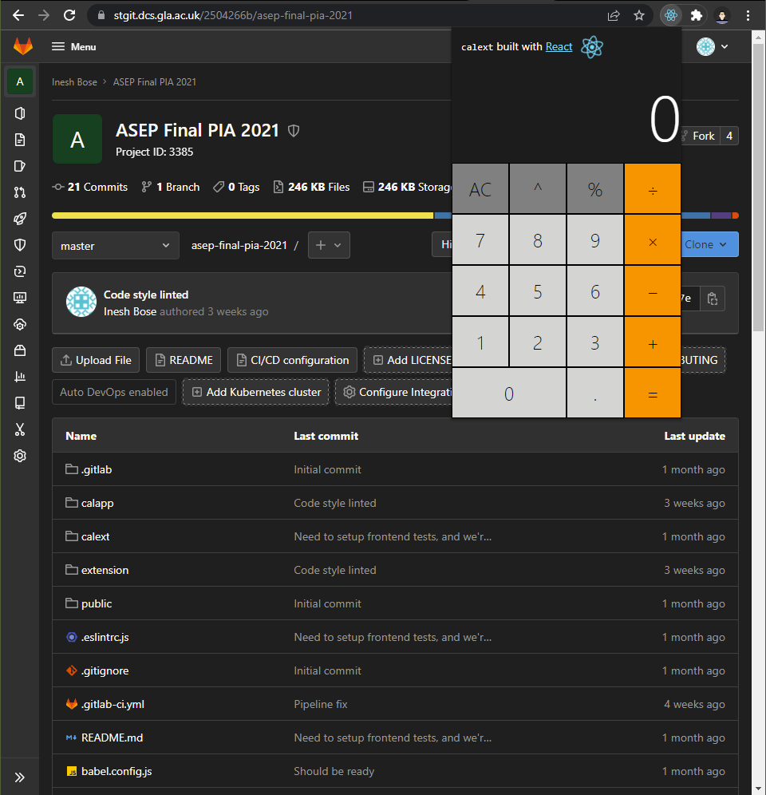
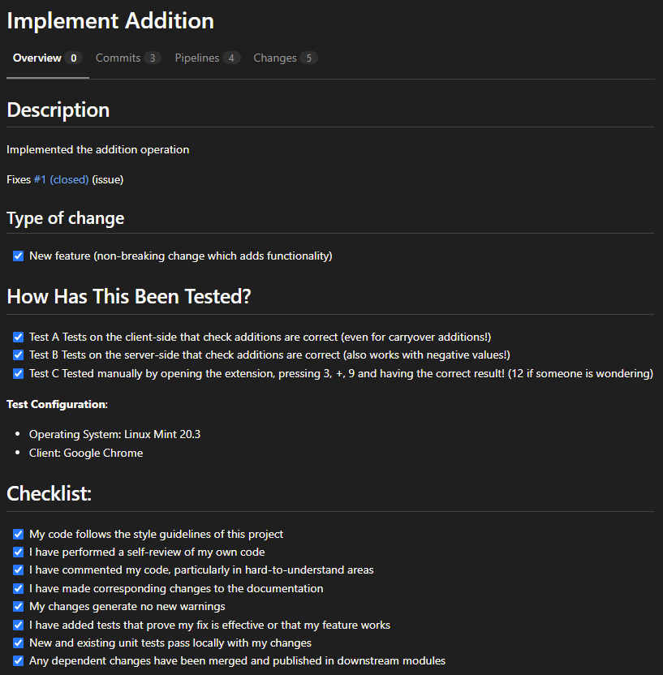
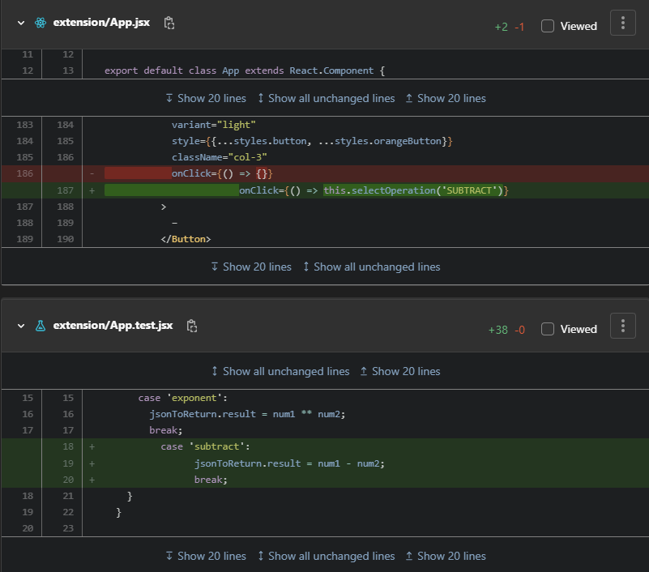
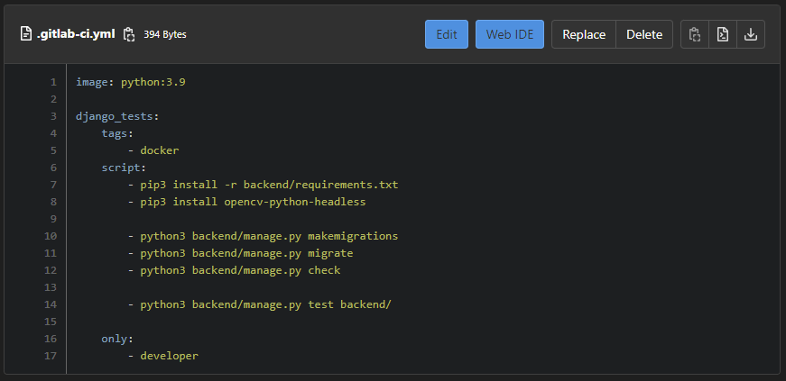

# ASEP Final Process Improvement Report

| Coach Name |
| ---------- |
| Inesh Bose |

| Coach Matriculation Number |
| -------------------------- |
| 2504266B                   |

| Team |
| ---- |
| CS20 |

## Writing Quality

| Comments                |
| ----------------------- |
| Well written throughout |

| Marks out of 10 |
| --------------- |
| 7               |

## Problem Identification

Over the course, through the coach meetings and the warmup PIA, the team has grown to solve problems and use best practices. Because of this, it was difficult to find a critical flaw in their development strategy. They have seemed to research into solutions for their project and have made good progress - they are near the final stages; this may have been possible because of their approach of working in different areas of the project like the backend server, parsing, interface and frontend client. While this approach seems great on paper, I was worried for the team facing *"subsystem optimisation"* where the team members would only have knowledge of the area they were working on.

The confirmation of this suspicion was when a major issue (one that required lot of effort and time) ended up being scrapped [1, [Weekly Diary 2 (Semester 2)](https://stgit.dcs.gla.ac.uk/2504266b/asep-coursework-2021/-/blob/master/weekly_diary_sem2_3.md)] as the team did not coordinate about what areas would be relevant to the issue. Along with this, the obvious signal about this problem was when each member appears to be on a different frequency - talking about completely different topics (relevant to their areas) with no other member having any knowledge about the same. If any member was also missing in action, that area would have less progress compared to others. Therefore, **the solution would come by having code reviews** within the team that would require each member to understand changes in different areas of the project, along with **improving their merge requests quality** as they felt they could be improved [1, [Weekly Diary 2 (Semester 2)](https://stgit.dcs.gla.ac.uk/2504266b/asep-coursework-2021/-/blob/master/weekly_diary_sem2_3.md)].

The team, being self-aware, had also mentioned that they should have pipelines and testing setup at this point. For the sake of focusing on only code reviews to improve on, **testing would be discussed for merge requests** as that can be seen as the first step of a code review - tests passing.

| Comments                                                     |
| ------------------------------------------------------------ |
| Good, I sympathise with the rationale for including testing, although think it risky.  If anything, I would have advised to address the testing issue first, before trying to tackle code reviews in a later (hypothetical!) PIA. |

| Marks out of 10 |
| --------------- |
| 9               |

## Description and Justification of PIA

Similar to the [warmup PIA [2]](https://stgit.dcs.gla.ac.uk/2504266b/asep-coursework-2021/-/blob/master/warmup.md), the PIA was sketched out and conducted on a [separate repository [3]](https://stgit.dcs.gla.ac.uk/2504266b/asep-final-pia-2021/) which would have a setup similar to theirs, but they would have to do minor feature implementations which are expected to take less than an hour if they follow the instructions and example given to them. The reason for this repository was for the team to have practical idea.

Once they have implemented their features (along with tests written for them), each merge request created by the members would be reviewed thoroughly to showcase the process of a code review. This was planned for the [warmup PIA [2]](https://stgit.dcs.gla.ac.uk/2504266b/asep-coursework-2021/-/blob/master/warmup.md) as well, but not the main focus.

This time, however, for the final PIA, code reviews are the priority. As mentioned during [problem identification](#problem-identification), this is to avoid the team members to specialise in their areas but be prompt with their whole project - no matter what size of the stack. There are also many additional advantages linked to conducting (regular) code reviews which the team could use; these include consistency in code style, design and implementation (elements like variable names, linting, etc), optimised code with better performance and less bugs (since the code is reviewed by others therefore avoiding logic errors), and better collaboration (making better estimates for issues, and improving quality for future tasks by allowing knowledge to be shared [8]).

| Comments                                                     |
| ------------------------------------------------------------ |
| Not completely clear if  the code reviews will take place on project code or not? |

| Marks out of 10 |
| --------------- |
| 6               |

## Monitoring and Evaluation

The evaluation would happen through the team continuing to use code reviews and merge requests in their project development practice. For the remaining issues they have for the remaining sprint(s), it would be expected that they work on them through issue branching which would create a merge request onto their development trunk. This merge request would need to be approved by all team members [6] after they would have gone through the changes and understood the solution. If there was something that they feel was confusing or done better, they could start a thread in the merge request [7] and this would mean that the team is collaborating more and producing better code.

Over couple of weeks, these merge requests would be observed and metrics such as comments, size, approval time will be noted. The expectation from these metrics would be to see how many commits were associated to a merge request, how many merge requests were approved from the team members and then merged, and finally how many merge requests did have problems (which should decline since they will review the code and decide on styling).

| Comments                                                     |
| ------------------------------------------------------------ |
| Excellent.  What about getting qualitative feedback from the team too? |

| Marks out of 10 |
| --------------- |
| 7               |

## Implementation Report

Referring to their project, a Django backend server with a React frontend app was setup. The React app would be a browser extension that would be a calculator and send an API call to the backend to get the result of an operation - just like how their project has a browser extension that would make a call to their Django server to generate CSV data from the tables on the page.

This activity project (called "*calext*") would allow users to raise a number to an exponent, and needed implementation for 1) addition, 2) subtraction, 3) multiplication and 4) division. Each member had one operation to implement and write tests for. This worked out very well for adequate changes in a merge request and to write test for the feature being added.

   

The team got on this early in the day, and then during the normal scheduled coach meeting which is at the end of the day, we did our code reviews where some articles and references were discussed that talk about advantages and guidance of code reviews [8, 9] including checklists [4, 5] that then was followed as the team went through each merge request. A big part of this included about the team members being human, which meant that mistakes are expected, and there should not be anything robotic. The code should be readable by another human that would be reviewing the merge request, and suggestions should be polite; for example, using "we" like "can ~~you~~ we refactor this to be recursive?". For each merge request made by a member, some questions were asked like:

- How did you feel about working on this?
- Did you have any troubles in making the changes?
- How was this tested?
- Is there anything you would like to do differently here?

| Comments                                                     |
| ------------------------------------------------------------ |
| Good, I think some more of this detail should be in the plan though and more information about how the implementation played out stated here. |

| Marks out of 10 |
| --------------- |
| 7               |

## Results

The team members took their time in making their changes and creating a merge request, but everyone was done before our scheduled meeting for the code reviews. Most merge requests had styling issues, and a lot of the implementations were similar to the code they were asked to refer to (which is not necessarily a problem). The team found the reviews very engaging since every member had the chance to interact, explain their changes and discuss alternatives.

   

The activity, unfortunately, failed and did not make the team make use of merge requests and code reviews. Their project had already reached a point of saturation where the main idea had been implemented and did not have enough motivation to go further but do the essentials which they did on the development trunk directly.

Their project, however, now has test suites at least which they were able to setup by the foundations provided by the PIA.

   

| Comments                                                     |
| ------------------------------------------------------------ |
| Hmm, so if you had collected metrics, they would have been all 0?  Think you should state this explicitly in a table. |

| Marks out of 20 |
| --------------- |
| 10              |

## Critical Assessment

It was upsetting to see the number of merge requests go down immediately to 0 right after the PIA had been conducted, since I was hoping to see results and gather insightful data. It would have been useful if the team had been made aware of this practice at the start of the project and see some real life applications / usage in the industry so that they had something to aim for. While my direct contribution, as a coach, to their project needs to be limited, if there were systems set up on their repository restricting direct commits to their trunk and setting up issues / branches, it would have given the team necessity to perform code reviews.

| Comments                                                     |
| ------------------------------------------------------------ |
| How could you have motivated code reviews to be adopted in the team?  Did you do any related reading on the issue? |

| Marks out of 20 |
| --------------- |
| 5               |

## Future Process Improvement Activity

Given that this activity failed, it would be beneficial for the team to improve their process and create a foundation for code reviews by doing **standups** where instead of reviewing practical code, they would update each other on the tasks that they are working on by answering simple questions like "what did I work on?", "what am I working on now?" and "what issues are blocking me?" which would highlight progress, flag team blockers and strengthen the team [10], so that when the time comes, that task could be followed-up, understood and reviewed. These standup meetings could be scheduled at the convenience of the team members (but needs to be regular, frequent and short), and also refer to a KANBAN board which could further aid their development.

| Comments                        |
| ------------------------------- |
| Good thinking here - excellent. |

| Marks out of 10 |
| --------------- |
| 9               |

## References

[1] Bose, Inesh. 2021. ASEP Coursework 2021. <https://stgit.dcs.gla.ac.uk/2504266b/asep-coursework-2021>

[2] Bose, Inesh. 2021. ASEP Warmup PIA 2021. <https://stgit.dcs.gla.ac.uk/2504266b/asep-warmup-pia-2021>

[3] Bose, Inesh. 2022. ASEP Final PIA 2021. <https://stgit.dcs.gla.ac.uk/2504266b/asep-final-pia-2021>

[4] Omeyer, Alex. 2021. Code Review: A Comprehensive Checklist. <https://dev.to/alexomeyer/code-review-a-comprehensive-checklist-5gnm>

[5] Glodian, Mykhailo. 2021. The Ultimate Code Quality Checklist. <https://duecode.io/blog/the-ultimate-code-quality-checklist/>

[6] GitLab. Review a merge request. <https://docs.gitlab.com/ee/user/project/merge_requests/reviews/>

[7] GitLab. Comments and threads. <https://docs.gitlab.com/ee/user/discussions/>

[8] Radigan, Dan. Why code reviews matter (and actually save time!). <https://www.atlassian.com/agile/software-development/code-reviews>

[9] Unadkat, Jash. 2020. Understanding Code Review and its Benefits. <https://www.browserstack.com/guide/code-review-benefits>

[10] Radigan, Dan. <https://www.atlassian.com/agile/scrum/standups>
