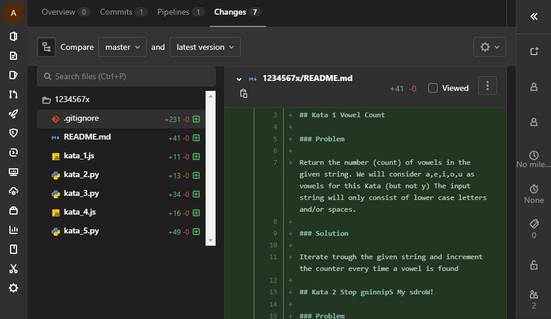
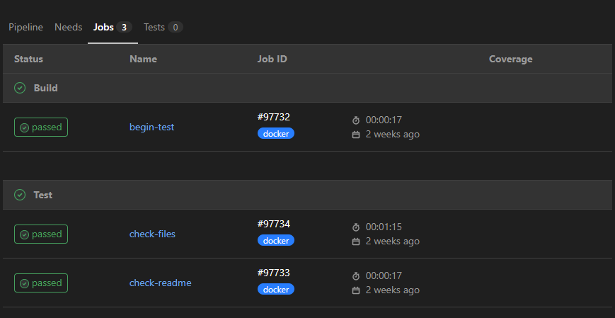
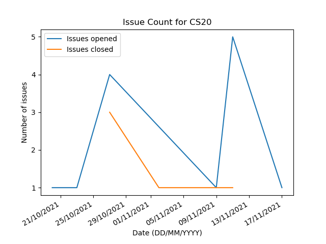
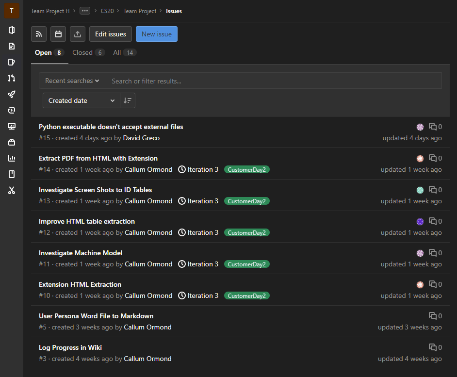

# ASEP Warmup Process Improvement Report

| Coach Name |
| ---------- |
| Inesh Bose |

| Coach Matriculation Number |
| -------------------------- |
| 2504266B                   |

| Team |
| ---- |
| CS20 |

## Writing Quality

| Comments |
| -------- |
|          |

| Marks out of 20 |
| --------------- |
|                 |

##  Problem Identification

<!-- Describe the problem, issue or opportunity that you wish to address with the Project Team. Explain what you think the underlying cause of the issue is for the team and provide evidence that you have that the problem you have identified is real. You are required to conduct formative assessments of your team's software process: use this to help identify an issue. -->

A problem identified with the team was everyone's lack of familiarity and comfort with **issue management** that relates to their agile approach and the process of project development. This was evident with their task management, planning [6], code reviews and quality of meetings where a few moments would also feel that they aren't efficient/productive because they have been affected [1, [Weekly Diary 3](https://stgit.dcs.gla.ac.uk/2504266b/asep-coursework-2021/-/blob/master/weekly_diary_3.md)]. It seemed that the team were unaware of best practices for the project like using templates or Markdown syntax to emphasis on text using hierarchy (through titles), and also taking up extra time and energy trying to familiarise themselves with the technologies (Git, Node, Jupyter Notebook, APIs) - most of them preferred to stick with what they were familiar with causing the roles to be confined and not have any flexibility.

| Comments |
| -------- |
|          |

| Marks out of 10 |
| --------------- |
|                 |

## Description and Justification of PIA

<!-- Describe the PIA you will undertake with the team. Explain why you think the activity will address the issue you have identified. You can provide references to descriptions of standard practices rather than repeating them in detail. However, you should outline any customisations you intend to make to a practice. -->

The PIA was sketched out and conducted on a [separate repository [2]](https://stgit.dcs.gla.ac.uk/2504266b/asep-warmup-pia-2021) with instructions and pipelines designed to tackle this issue, but also help CS20 get a better grip of their tech stack. This activity had three main outcomes:
- being more comfortable with Python and JavaScript (their project's main programming languages) so that each team member is able to understand and work on every bit (making code reviews easier) instead of one team member being responsible for a major part thinking that only he/she/they would be able to make changes and fix bugs in that area;
- using and understanding more areas of a version control system like Git so that everyone is confident with their commits and use best practice like using templates and putting a description for issues and pull/merge requests (also making code reviews and estimating tasks better);
- improving team coordination through issue creation/management, collaborations and code reviews that would help their code to be understood and reviewed by everyone and giving confidence that their code is of good quality eventually delivering a **quality product** that the team can be proud of.

Even though during the coach meetings, the team would be asked to emphasise on issue management and repository maintenance (`README.md`, templates [3], `.gitignore` [4], Wiki) [1, [Weekly Diary 5](https://stgit.dcs.gla.ac.uk/2504266b/asep-coursework-2021/-/blob/master/weekly_diary_5.md)], a proper PIA was to be sketched out so that the team members would follow and work on instructions themselves instead of listen to words in air and not put it to practice.

| Comments |
| -------- |
|          |

| Marks out of 10 |
| --------------- |
|                 |

## Monitoring and Evaluation

<!-- Describe how you will evaluate the PIA. State your objectives for the PIA. You should state any measurements that you will record, how and when you will record them and how you plan to evaluate them. Measurements may be quantitative (lines code, for example) or qualitative (discussions during a retrospective, for example). -->

The evaluation for this PIA was qualitative, but systematic. Even though "best practice" is subjective and based on preference, the idea was to use the *most* preferred and a certain consistent expectation was set from each team member. This expectation pertained to the quality of their output from the activity which was in the form of code changes/additions and how they handled/managed/created their issue [2, [Issues](https://stgit.dcs.gla.ac.uk/2504266b/asep-warmup-pia-2021/-/issues?scope=all&state=all)]. Therefore, they were evaluated using code reviews and a [test pipeline [2, `.gitlab-ci.yml`]](https://stgit.dcs.gla.ac.uk/2504266b/asep-warmup-pia-2021/-/blob/master/.gitlab-ci.yml).

| Comments |
| -------- |
|          |

| Marks out of 10 |
| --------------- |
|                 |

## Implementation Report

<!-- Provide an overview of the implementation of the PIA, including the dates, times when activities took place and the teams which participated. Summarise problems or unexpected situations that arose during the implementation of the PIA.
Report any changes that were made to the implementation plan as a result of problems encountered during the implementation of the PIA. Give the reasons that the changes were made, including any supporting evidence (qualitative and/or quantitative) that justified the change. -->

When the outcomes were first planned and decided for the PIA, the task was tailored accordingly. The first step was to list their individual tasks as [issues](https://stgit.dcs.gla.ac.uk/2504266b/asep-warmup-pia-2021/-/issues) [7] using a suitable template from the [provided [2, Issue Templates]](https://stgit.dcs.gla.ac.uk/2504266b/asep-warmup-pia-2021/-/tree/master/.gitlab/issue_templates). There would be two ways of doing this - listing the issue as a bug as "the project is missing these files", or listing it as a feature as "a new module of files has to be added" - the preferred one would be feature. These issues would be linked with the merge requests that the team would create. As for getting familiar with Python and JavaScript, a handful of challenges ("*kata*") were selected from [Codewars](https://www.codewars.com/) as it is a popular, community based platform which does not necessarily require an account to be setup to use it [5]. The challenges were of low difficulty ("*kyu"*) - three were in Python and two in JavaScript. The team was told with bold emphasis to not focus on getting the code to run since that is not the priority. These challenges would be copy-pasted on files named `kata_N.[js|py]` that would be in a directory named after their GUID (`1234567x/`) placed along with a `README.md` and `.gitignore` within the same location. While content was not required in `.gitignore`, it was encouraged to list files they can think of or use from the [templates [4]](https://github.com/github/gitignore). The README, however, was required to be filled in following a format that would explain what they did for each challenge [12]. Once the files were in order, the team can push the changes on their forked repository and create a [merge request](https://stgit.dcs.gla.ac.uk/2504266b/asep-warmup-pia-2021/-/merge_requests) that would, again, use a [template [2, Merge Request Template]](https://stgit.dcs.gla.ac.uk/2504266b/asep-warmup-pia-2021/-/blob/master/.gitlab/merge_request_templates/Merge%20Request.md) and should be filled in appropriately with the linked issue [8]. A pipeline was setup to run tests on their MR quality and code changes. Once everyone reached this point, a code review would be conducted going over each merge request.

| Comments |
| -------- |
|          |

| Marks out of 10 |
| --------------- |
|                 |

### Results

<!-- Present a detailed breakdown of the data gathered during the PIA. You do not need to include the raw data gathered during the PIA, although you may include this in an appendix if you wish. Rather, you should summarise the key results identified in the data, such as trends in quantitative data, or important themes gathered from qualitative data, such as retrospectives (include extracts from discussions as appropriate). You can also use graphs to illustrate quantitative data. -->

The team did the activity surprisingly well - some did it in one sitting while some had to go home and take several hours. The issues were created immediately (mostly due to the template already provided and with a few details to fill in) with the right information; all merge requests were correctly linked to the issues they were closing. They also faced some common issues (like pushing to the original repository - unauthorised, configuring Git to be case sensitive) that gave them enough knowledge to counter and avoid errors in the future. They were also lot more familiar with Markdown because of this giving more familiarity and confidence on issue, merge request, wiki creation. During the code review, a few mistakes were also pointed out; this, again, ensures that their code changes are of good practice and quality. In the following weeks, it seemed that the team were creating more tasks as issues that were being assigned to members [6], and so in their meetings they would also have more concrete information to point to and talk about. For example, earlier they would not know each other's tasks and use memory instead, but now they are able to point to a specific issue on the repository and discuss progress by seeing changes on the relevant branch.

   
   
   

| Comments |
| -------- |
|          |

| Marks out of 20 |
| --------------- |
|                 |

## Critical Assessment

<!-- Develop A critical assessment of the success and/or failure of the PIA based on the data gathered during the exercise. You should present an honest assessment of the PIA, identifying both successes and failures as appropriate. Link the  discussion to evidence captured during the exercise. Relate the evidence to other literature that covers similar PIA
   activities, such as similar case studies, text book descriptions of the PIA that include risks and benefits and/or industry white papers. -->

Having a planned out PIA where the team practices what they're told was successful. While it may have been a bit too difficult for a warmup activity, it was also very beneficial for the team and to also be aware of the same early on [9, 10, 11]. This activity may have also caused a few of their tasks to be shifted back, however, in the long run the future tasks should be worked on much better.

| Comments |
| -------- |
|          |

| Marks out of 20 |
| --------------- |
|                 |

## Future Process Improvement Activity

<!-- Make a recommendation for a future process improvement activity. This should be related to your insights gathered during this activity. For example, if you found that pair programming was ineffective, is their reason to believe an alternative collaborative activity, such as continuous code reviews, or mob programming would be more effective. Explain your reason for choosing an activity. -->

Since the warmup activity laid a base for future activities, it would be great for the team to take the front seat, **incorporating automation**, in doing tasks where they conduct discussions, code reviews and tests (using pipelines). This could mean the team taking a lead on issues for their project themselves, working on branches and then creating merge requests that would run pipelines in the `test` stage, with the entire team going over and understanding the changes.

| Comments |
| -------- |
|          |

| Marks out of 10 |
| --------------- |
|                 |

## References

[1] Bose, Inesh. 2021. ASEP Coursework 2021. https://stgit.dcs.gla.ac.uk/2504266b/asep-coursework-2021

[2] Bose, Inesh. 2021. ASEP Warmup PIA 2021. https://stgit.dcs.gla.ac.uk/2504266b/asep-warmup-pia-2021

[3] GitLab. 2016. Description templates. https://docs.gitlab.com/ee/user/project/description_templates.html

[4] GitHub. 2010. A collection of `.gitignore` templates. https://github.com/github/gitignore

[5] Codewars. https://www.codewars.com/about

[6] CS20. 2021. Team Project - Issues. https://stgit.dcs.gla.ac.uk/team-project-h/2021/cs20/cs20-main/-/issues

[7] GitLab. 2017. Issues. https://docs.gitlab.com/ee/user/project/issues/

[8] GitLab. 2019. Managing issues - Default closing pattern. https://docs.gitlab.com/ee/user/project/issues/managing_issues.html#default-closing-pattern

[9] Milliron, James. 2018. How to set up an issue management system for your company. https://www.donedone.com/blog/how-to-set-up-an-issue-management-system-for-your-company

[10] Ćosić, Dragana. 2021. 15 Best Issue Management Software to Identify and Resolve Issues. https://startinfinity.com/blog/issue-management-software

[11] Bridges, Jennifer. 2019. 8 Steps for Better Issue Management. https://www.projectmanager.com/training/managing-project-issues

[12] Pritchard, Adam. 2017. Markdown Cheatsheet. https://github.com/adam-p/markdown-here/wiki/Markdown-Cheatsheet
